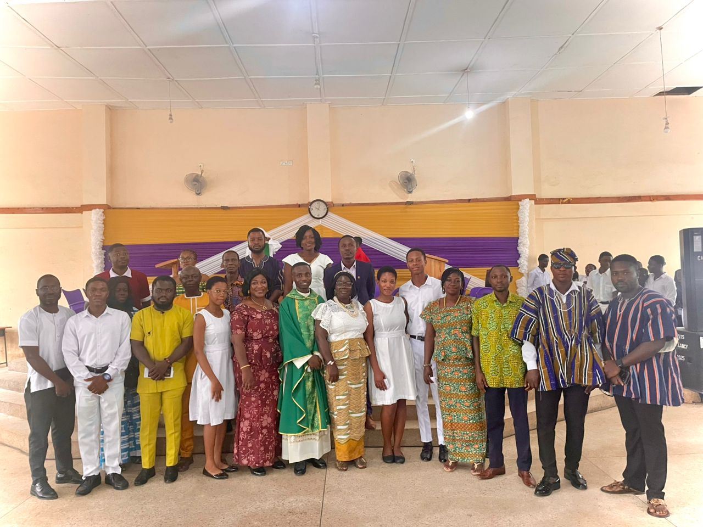
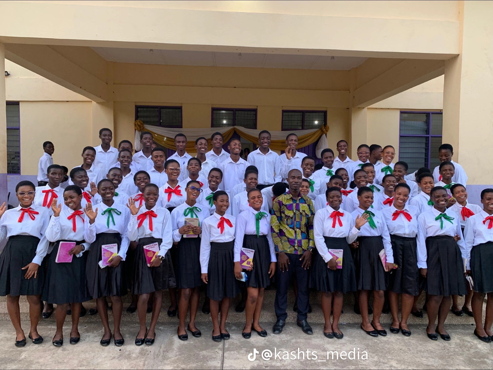
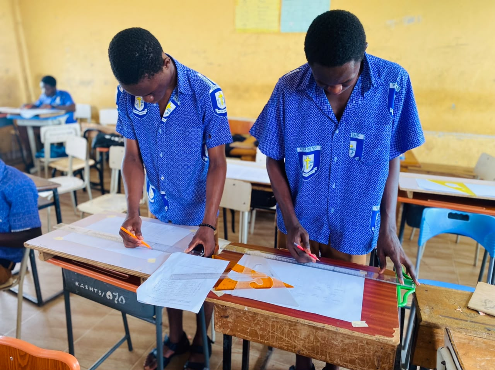
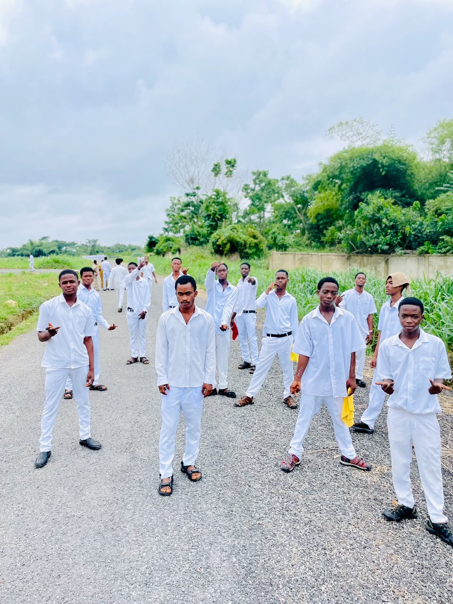

<!DOCTYPE html>
<html lang="en">
<head>
<meta charset="UTF-8">
<meta name="viewport" content="width=device-width, initial-scale=1.0">
<title>Kwabeng Anglican Senior High Tech School</title>

</head>
<body>

<!-- ===== CONSTANT DASHBOARD ===== -->
<header>
  

    

      
      KWABENG ANGLICAN SHS TECH <small>BODY • SOUL • MIND</small>
    

    

      <button class="tab-btn active" onclick="showPage('home')">Home</button>
      <button class="tab-btn" onclick="showPage('about')">About</button>
      <button class="tab-btn" onclick="showPage('gallery')">Gallery</button>
      <button class="tab-btn" onclick="showPage('academics')">Academics</button>
      <button class="tab-btn" onclick="showPage('admission')">Admission</button>
      <button class="tab-btn" onclick="showPage('contact')">Contact</button>
    

  

</header>

<main class="container">

  <!-- ===== PAGE 1: HOME ===== -->
  <section id="home" class="page active">
    

      <h1>Welcome to Kwabeng Anglican SHS Tech</h1>
      
Established 1983. Training leaders in Body, Soul, and Mind for service to God and country.

      

        <button class="btn" onclick="showPage('admission')">Apply Now</button>
        <button class="btn btn-outline" onclick="showPage('gallery')">View Gallery</button>
      

      
      

        
<h3>Est. 1983</h3>
Over 40 years of academic and Moral excellence

        
<h3>8 Programs</h3>
Science, Agriculture, Arts, Technical, Business, Home Economics

         
<h3>School Category</h3>
 B 

        
<h3>Boarding & Day</h3>
Mixed gender school in Kwabeng, Eastern Region

      

      
"BODY • SOUL • MIND"

    

  </section>

  <!-- ===== PAGE 2: ABOUT ===== -->
  <section id="about" class="page">
    <h2>About KASHTS</h2>
    
Kwabeng Anglican Senior High Tech School is committed to holistic education rooted in Anglican values.

    

      
<h3>Our Mission</h3>
To provide quality Discipline, Religious values and Academic excellence that develops the whole person - Body, Soul, and Mind.

      
<h3>Our Vision</h3>
To be a center of excellence producing disciplined, skilled, and God-fearing leaders.

      <h3>Our Crest</h3>
        
    

  </section>

  <!-- ===== PAGE 3: GALLERY ===== -->
  <section id="gallery" class="page">
    <h2>KASHTS Gallery</h2>
    
Life at Kwabeng Anglican SHS Tech

    
    

      <button class="filter-btn active" onclick="filterGallery('all')">All</button>
      <button class="filter-btn" onclick="filterGallery('students')">Students</button>
      <button class="filter-btn" onclick="filterGallery('campus')">Campus</button>
      <button class="filter-btn" onclick="filterGallery('events')">Events</button>
    

    

      

School Choir

      

School Bus

      

Students

      

Main School Block

      

Headmistrees

            

School Church Cloth

            

School Staffs

      

Students

       

Campus

         

School Life

     

School Chaplincy Head

            

KASHTS Media

           

School Choir

      

Holy Spirit Mood

    

Anniversiry Day

 

School Entrance

       

Sunday Service

  

Technical class

        

Asist Head Domestic

    

School Church Wear

     

ICT Lab

      

Science Block

       

Dormatory

        

School Cardet

        

School Uniform

          

Classroom

          

Past Students

    

  </section>

  <!-- ===== PAGE 4: ACADEMICS ===== -->
  <section id="academics" class="page">
    <h2>Academic & Technical Programs</h2>
    
Choose your path to excellence

    

      
<h3>General Arts</h3>
Economics, Literature, Government, History, Information Communication & Technology, Elective Math, Geography, CRS, French, Twi, General Knowledge In Arts

      
<h3>General Science</h3>
Physics, Chemistry, Biology, Elective Math, Information Communication & Technology

       
<h3> Agriculture Science</h3>
Physics, Chemistry, Fishery, Crops, General Agriculture, Elective Math, Animal Husborndery

      
<h3>Technical</h3>
Applied Electricity & Electronics ,   Building Contruction, Elective Math, Physics, Technical Drawing

      
<h3>Visual Arts</h3>
Graphic Design, Picture Making, General Knowledge In Arts, Ceramics, Jewellery, Portery, Textiles

      
<h3>Home Economics</h3>
Food & Nutrition, Clothing, Management In Living, Economics, General Knowledge In Arts 

      
<h3>Business</h3>
Accounting, Costing, Economics, Business Management

    

  </section>

  <!-- ===== PAGE 5: ADMISSION ===== -->
  <section id="admission" class="page">
    <h2>Admissions 2026/2027</h2>
    
Join the KASHTS Family. Body Soul Mind.

    
    

      
<h3>Requirements</h3>
BECE Certificate, Placement Slip, Birth Certificate, 4 Passport Pictures

      
<h3>Cut-off Point</h3>
Check GES Placement. Both Boarding and Day available.

    

    <form onsubmit="alert('Application received! KASS will contact you shortly.');return false;">
      <input type="text" placeholder="Student Full Name" required>
      <input type="tel" placeholder="Parent/Guardian WhatsApp Number" required>
      <select required>
        <option value="">Select Program</option>
        <option>General Science</option>
        <option>General Arts</option>
        <option>Agriculture Science</option>
        <option>Technical</option>
        <option>Visual Arts</option>
        <option>Home Economics</option>
        <option>Business</option>
      </select>
      <textarea placeholder="Any Questions?" rows="4"></textarea>
      <button class="btn" type="submit">Submit Application</button>
    </form>
  </section>

  <!-- ===== PAGE 6: CONTACT ===== -->
  <section id="contact" class="page">
    <h2>Contact KASHTS</h2>
    
We’d love to hear from you

    

      
<h3>Address</h3>
Kwabeng, Eastern Region, Ghana P.O. Box 03, Akyem-Kwabeng

      
<h3>Phone</h3>
024 480 0137 | 020 555 2735

      
<h3>Connect To KASHTS: </h3>
KASHTS Media on TicTok

    

  </section>

</main>

<!-- ===== LIGHTBOX FOR GALLERY ===== -->

  &times;
  

<footer>© 2026 Kwabeng Anglican Senior High Tech School | BODY • SOUL • MIND | Est. 1983</footer>

</body>
</html>
